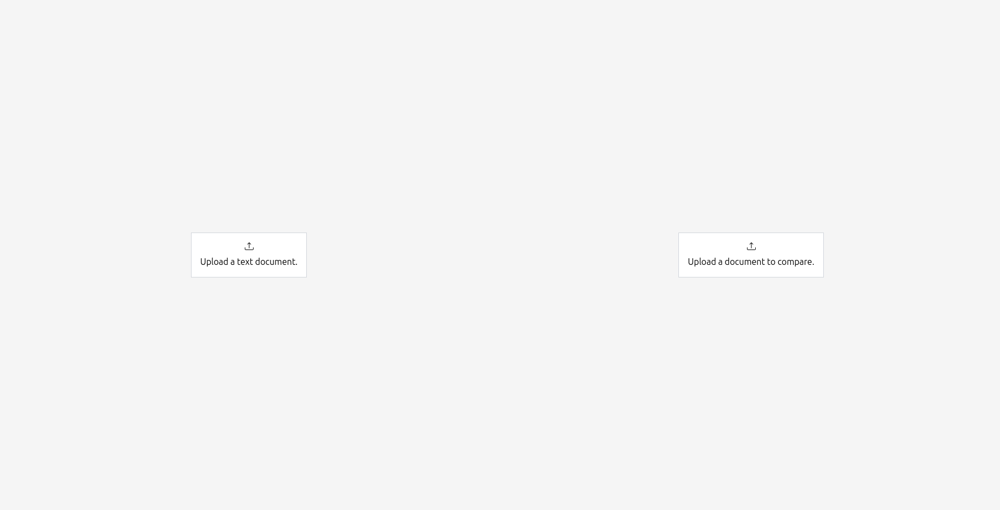

# Comparative Reader Web App

## Problem Statement

The project is a UI concept designed to enable comparative reading of documents, with an emphasis on intuitive user interaction and effective visualization of textual similarities. Users will be able to load two documents side-by-side, with the UI dynamically highlighting similar text sections. The comparison should identify text overlap, paraphrasing, and other similarity aspects.

**Target Operating System**: Cross-platform (Browser-based).

## User documentation



You can upload text files from your computer using the file inputs in the main view. The sentences selected from the left document (**source**) are compared against all sentences from the right document (**target**). You can swap the uploaded documents as needed. Once both documents are selected, a bottom toolbar appears that allows you to adjust similarity sensitivity threshold, pick between different similarity models, and navigate between similarity occurrences. 


### Features

#### Text search
- Search them by exact text using their respective **search bars**. It also displays number of occurrences.
- You can then navigate between the segments containing your query using the arrows near the search bar.
- All search occurrences are highlighted in bold.

#### Similarity search
- Compare parts of the source document to the target document by selecting segments with your mouse.
- You can click to toggle selection or drag to select multiple segments.
- Press **ESC** to clear selection.
- Hold the **Ctrl** key to select discontinuous parts of text.
- You can navigate between the **occurrences** using the arrow keys in the bottom toolbar. Current occurrence is highlighted in bold.
- Hover the highlights on the right to see the similarity percentage of a given segment to your selection, click to navigate there.
- If you want to highlight more or less segments, you can adjust the **sensitivity** in the bottom toolbar.

## Program Structure

- **Languages and Frameworks**:
  - **Frontend**: TypeScript, [Solid.js](https://www.solidjs.com/).
  - **Backend**: Python, [FastAPI](https://fastapi.tiangolo.com/).
  - **Testing Data**: The [Memorise](https://ufal.mff.cuni.cz/grants/memorise) corpus, [ELITR Minuting Corpus](https://lindat.mff.cuni.cz/repository/xmlui/handle/11234/1-4692#).

- **Frontend**:
  - `index.tsx` - the entry point.
  - `App.tsx` - main view, contains app layout and sets up global keyboard shortcut listeners.
  - `components` - contains all of the UI components.
  - `store` - contains all state logic and is composed of several modules.
    - `index.ts` - root, has source and target document states, sets up similarity and selection stores. Contains `swapDocuments` function as it is a global action.
    - `document.ts` - individual state of a document: file, content, text search data, loading state.
    - `selection.ts` - segment selection logic.
    - `similarity.ts` - similarity and sensitivity logic.
    - `api.ts` - backend connection and request types.
  - UI components trigger actions from the store.
   
- **Backend**:
  - `main.py` - contains all of the backend logic for now.
    - `/upload-segments` - receives a list of segments and stores a sentence embedding for each. Uses a [`MiniLM-L6` sentence transformer](https://huggingface.co/sentence-transformers/all-MiniLM-L6-v2).
    - `/compute-similarity` - receives segment ids from the source document and computes cosine similarity of their mean embedding to all target embeddings, returns normalized coefficients and segment ids in descending order of their similarity.
    - `/swap-documents` - swaps source and target embeddings to avoid recomputing them.

## Installation

You need [yarn](https://classic.yarnpkg.com/lang/en/docs/install/) to install and run the frontend part of the application and [python3](https://www.python.org/downloads/) for the backend.

### Frontend

1. **Navigate to the frontend directory**:
  ```bash
  cd frontend
  ```

2. **Install dependencies**:
  ```bash
  yarn install
  ```

3. **Run the development server**:
  ```bash
  yarn dev
  ```
  Open [http://localhost:3000](http://localhost:3000) to view it in the browser.

### Backend

1. **Navigate to the backend directory**:
  ```bash
  cd backend
  ```

2. **Create a virtual environment**:
  ```bash
  python -m venv venv
  ```

3. **Activate the virtual environment**:
  - On Windows:
    ```bash
    .venv\Scripts\activate
    ```
  - On macOS/Linux:
    ```bash
    source .venv/bin/activate
    ```

4. **Install dependencies**:
  ```bash
  pip install -r requirements.txt
  ```

5. **Run the backend server**:
  ```bash
  fastapi dev main.py
  ```
  The backend server will be running at [http://localhost:8000](http://localhost:8000). You can access API docs at [http://localhost:8000/docs](http://localhost:8000/docs).

### Running the Full Application

1. **Start the backend server** as described in the Backend section.
2. **Start the frontend development server** as described in the Frontend section.
3. Open [http://localhost:3000](http://localhost:3000) to use the application.